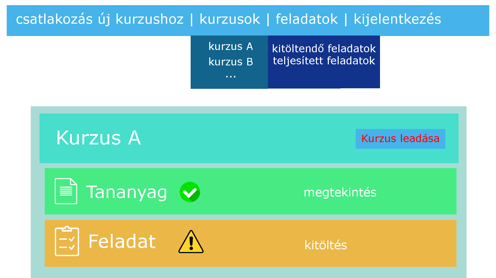

# 1. Bevezetés

Megrendelő részéről kaptunk egy olyan elképzelt weboldalt amely segíti a munkájukat a tananyagok elkészítésében és könnyíti ezen anyagok eljutását a diákokhoz. 

# 2. Célok

...

# 3. Jelenlegi helyzet

...

# 4. Követelménylista

Felhasználói szintek:
- Adminisztrátor
- Tanár
- Tanuló

Látogatóként és újonnan regisztrált felhasználóként csak a kezdőlap látható, illetve a regisztráció és a bejelentkezés. Tanuló jogosultságot csak tanár és adminisztrátor adhat.

Tanárok által elérhető funkciók:
- létrehozhat/ feltölthet tananyagokat
- létrehozhat/ feltölthet tesztanyagok, kérdések

Tanulók által elérhető funkciók
- tananyagok
- tesztek

Adminisztrátornak mindenhez van jogosultsága

# 5. Használati esetek

...

# 6. Képernyőtervek

Képernyőterv a diák / vendég felhasználó szemszögéből:

# 7. Forgatókönyvek

Regisztráció: Az e-learning felület megnyitását követően a kezdőlapon található regisztráció gombra kattintva tudunk regisztrálni. A gombra kattintás után  megadhatjuk a szükséges adatokat, valamint kiválaszthatjuk, hogy Tanárként vagy Tanulóként kívánunk regisztrálni. A Regisztráció gombra kattintva a kezdőlap jelenik meg, amennyiben helyes adatokat adtunk meg.

Bejelentkezés: Az oldal megnyitása után a navigációs sávon a Bejelentkezés gomb segítségével tudunk a korábban már létrehozott fiókunkba belélni. A Bejelentkezés gombra kattintva megadhatjuk felhasználónevünk, valamint jelszavunk. Helyes adatokat megadva és a Bejelentkezés gombra kattintva a fiókunkba lépünk be.

Tananyagok kezelése tanulóként: Tanuló fiókba történő bejelentkezést követően lehetőségünk van a Tananyagok menüpontban különböző tananyagokhoz hozzáférést igémyelni. Ezt a  tananyag nevére, majd a Hozzáférés igénylése gombra kattintva tehetjük meg. Miután a tananyagot létrehozó tanár vagy az adminisztrátor megadja a hozzáférést, olvasni tudjuk a tananyagot.

Tananyagok kezelése tanárként: Tanár jogosultságú felhasználóval bejelentkezve, a Tananyagok menüpontban lehetőségünk van új tananyagokat létrehozni és meglévő, általunk létrehozott tananyagokat szerkeszteni.

Tesztek kezelése tanulóként: Tanuló felhasználóval bejelentkezve a Tesztek menüpontban azon tananyagok tesztjeit/kérdéseit tekinthetjük meg és oldhatjuk meg, amelyekhez korábban hozzáférést kaptunk.

Tesztek kezelése tanárként: Tanár fiókba bejelentkezve, az általunk létrehozott tananyagokhoz lehetőségünk van tesztek/kérdések feltöltésére, a Tesztek menüpontban.

Hozzáférés megadása tanulónak: Tanár fiókkal bejelentkezve a Kérések menüpontban láthatjuk azon diákok felhasználóneveit akik az általunk létrehozott tananyagokhoz szeretnének hozzáférni. A felhasználónév mellett található checkbox bepipálásával, majd a Hozzáférés megadása gombra kattintva engedélyezhetjük a tananyagok és tesztek megtekintését.
Adminisztrátor jogosultságú felhasználó minden tananyaghoz tartozó kérést jóvá tud hagyni, nem csak az általa létrehozottakhoz tartozót.

# 8. Fogalomszótár

...