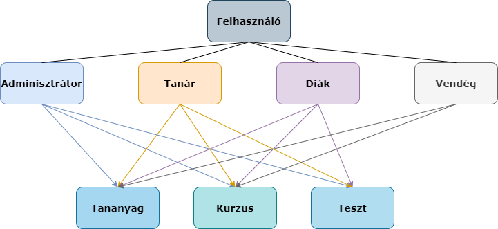

# 1. A rendszer célja

A rendszer célja egy olyan weboldal létrehozása, ahol a tanuló a tanár által közzétett tananyagot digitális formában sajátíthatja el, egy felhasználóbarát környezetben.
A tanárok gyorsan és egyszerűen hozhatnak létre tananyagokat és feladatokat az oldalon. Minden tananyaghoz kapcsolódhat egy feladat, hogy a tanár megtekinthesse, hogy mennyire sikerült a diákoknak feldolgozni az adott tananyagot. A feladatok a diákok számára is visszanézhetőek, így megtekinthetik, hogy mit tudtak helyesen megoldani és mi volt az amit elrontottak.

Az oldal használatához be kell jelentkezni a megfelelő felhasználói fiókkal. Az első bejelentkezés előtt regisztrálni kell egy új felhasználót a rendszerbe.

Az oldalt négy különböző típusú felhasználóval lehet használni:
- **Vendég felhasználó:** nem kell bejelentkeznie, de nem is csatlakozhat semmilyen kurzushoz, csak megtekintheti azokat.
- **Tanuló:** bejelentkezés után megtekintheti a kurzusokra feltöltött tananyagokat és kitöltheti a tananyagokhoz tartozó feladatokat.
- **Tanár:** bejelentkezés után létrehozhat kurzusokat és feltölthet feladatokat és tananyagokat a már meglévő kurzusokhoz.
- **Adminisztrátor:** minden joga megvan, törölhet felhasználókat, kurzusokat, feladatokat és tananyagokat.

# 2. Projekt terv

A projekt egy e-learning alkalmazás, ami PHP alapokon nyugszik. E mellett HTML-t, CSS-t és JavaScript-et használunk. Az adatbázis MySQL. Minden részt a fejlesztőcsapat minden tagja fejleszti. 
A feladatok kiosztását és ütemtervét Trelloban vezetjük, a projectet pedig GIT használatával fejlesztjük közösen. A kommunikáció discordon folyik hang és szöveges csatornákon. 

Project ütemterve:

1. Alkalmazásötlet egyztetése
2. A fejlesztőkörnyezetek egyeztetése
3. Ütemterv
4. Követelmény specifikáció
5. Funkcionális specifikáció
6. Rendszerterv
7. Adatbázis kialakítása
8. Backend funkciók elkészítése
9. Frontend design megtervezése
10. Felhasználói felület kialakítása
11. Tesztelés
12. Bemutatás / Átadás

# 3. Üzleti folyamatok modellje

- Üzleti szereplők:
  - Felhasználók: Felhasználóvá a felületen történő regisztrációval válhat a látogató. A regisztráció során szerzett jogosultság határozza meg, hogy a felhasználó milyen funkciókhoz férhozzá a felületen. A felhasználóknak 3 csoportját különböztetjük meg:
    - Tanár: A tanár jogosultsággal rendelkező felhasználók képesek kurzusokat létrehozni, tananyagokat feltölteni, teszteket létrehozni. A tanárok hagyják jóvá a diákok kurzusra történő jelentkezését. Továbbá adatlapuk megtekintésére és szerkesztésére is lehetőségük van.
	- Diák: A diák jogosultságal endelkező felhasználők képesek azon kurzusok tananyagát/tesztjeit megtekinteni/kitölteni amelyekhez hozzáférést kaptak. Továbbá megtekinthetik és szerkeszthetik adalapjukat.
	- Adminisztrátor: Az adminidztrátor jogkört nem igényelheti a felhasználó. Azt a rendszer üzemeltetője osztja ki. Teljes hozzáféréssel rendelkeznek az összes funkcióhoz. Képes a tananyagok és tesztek teljeskörű menedzselésére, valamint a hibakezelések is az ő jogkörébe tartoznak.

- Üzleti folyamatok: 
  
  - Felhasználó regisztrációja: A felhasználó egy regisztrációs form kitöltésével tud regisztrálni. A sikeres regisztrációhoz az alábbi adatok megadása szükséges.    
    - Felhasználónév: Egyedinek kell lennie.
	- Jelszó: Legalább 6 karakter hosszúságúnak kell lennie.
	- Jelszó megerősítése: A megadott jelszóval megegyezőnek kell lennie.
	
	A jelszavalók hashelve kerülnek az adatbázisba.
	
  - Felhasználó azonosítása: A felhasználó a bejelentkezés során a megfelelő mezőkbe megadja felhasználónevét és jelszavát, majd a rendszer ellenőrzi, hogy a felhasználó szerepel-e az adatbázisban. Amennyiben szerepel, a jelszóea a megfelelő titkosítási algoritmust alkalmazza és ellenőrzi, hogy a felhasználóhoz tárolt jelszó megegyezik-e a felhasználó által bevittel. Ha az azonosítás sikeres, a felhasználó az e-learnng nyitó oldalára kerül. Amennyiben az azonosítás sikertelen, a rendszer a megfelelő hibaüzenettel értesíti a felhasználót.
  - Jelszó visszaállítása: Ez a funkció lehetőséget biztosít a jelszó visszaállítására, ha a felhasználó elfelejtette azt. Új jelszó beállítása során a felhasználónak meg kell adnia felhasználónevét, az új jelszót és a jelszó megerősítése érdekében újra az új jelszót. Az új jelszónak is legalább 6 karakter hosszúnak kell lennie.
  - Profiladatok módosítása: A felhasználók számára biztosít lehetőséget hogy felhasználónevüket és/vagy jelszavukat módosítsák. Módosítás során az adatoknak a regisztráció során felsorolt tényezőknek kell megfelelni.
  - Tananyag feltöltése: Taná jogosultságú felhasználónak lehetősége van új tananyagokat feltölteni,a feltöltött anyagot módosítani és törölni is. Ezeket a tananyagokat azok a diákok tudják olvasni, akik hozzáférést kaptak a tananyagokhoz.
  - Tesztek feltöltése: A rendszer lehetőséget biztosít a tanárok számára az általuk létrehozott tananyagokhoz tesztek feltöltésére. Ezen tesztek kitöltésével tudják a tnulók tudását ellenőrizni.
  - Hozzáférés igénylése: Diákok számára elérhető funkció, mellyel a számukra szükséges tananyagokhoz igényelhetnek hozzáférést, amit a tananyagot létrehozó tanár tud megadni.
  - Tesztek megírása: Diákok számára lehetséges a tananyag elolvasása után a tananyaghoz tartozó teszteket megírni.
  - Tesztek eredménye: A tesztek megírása után egy értékelés látható a tesztek végeredményével.

# 4. Követelmények

**Funkcionális követelmények**

- Regisztráció
- Bejelentkezés
- Kijelentkezés
- Jelszó visszaállítása
- Felhasználói adatok megtekintése, módosítása
- Tananyag létrehozása, módosítása, törlése
- Tesztek létrehozása, módosítása, törlése
- Kurzusra jelentkezés
- Kurzus jelentkezés elfogadása
- Tesztek kitöltése
- Tesztek eredményének megtekintése
- Hiba esetén az adminisztrátor értesítése

**Nem funkcionális követelmények**

- A felhasználók más adataihoz nem férnek hozzá
- A diákok nem tudják módosítani és törölni a kurzusokat és teszteket
- Vendégek számára nem elérhetőek a kurzusok
- Bejelentkezett felhasználók számára nem elérhető a regisztráció és a bejelentkezés gomb.

**Törvényi előírások, szabványok**

- GDPR

# 5. Funkcionális terv

**Rendszerszereplők:**
  - Adminisztrátor
  - Tanár
  - Diák
  - Vendég

**Rendszerhasználati esetek és lefutásaik:**
  - **Adminisztrátor**
    - Felhasználók adatainak módosítása, felhasználók törlése
    - Kurzusok hozzáadása, kurzusok módosítása és törlése

  - **Diák**
    - Kurzusok megtekintése
    - Kurzus felvétel
    - Kurzus leadás

  - **Tanár**
    - Kurzusok megtekintése
    - Kurzus létrehozása
    - Kurzus szerkesztése

  - **Vendég**
    - Kurzusok megtekintése

**Menü-hierarchiák:**
 - **Adminisztrátor**
      | Kurzusok | Tananyagok | Feladatok | Felhasználók | Profil                 |
      |----------|------------|-----------|--------------|------------------------|
      |          |            |           |              | Adataim                |
      |          |            |           |              | Jelszó megváltoztatása |
      |          |            |           |              | Kijelentkezés          |
    

  - **Diák**
      | Kurzusok                 | Feladatok | Profil              |
      |--------------------------|-----------|------------------------|
      | {Felvett aktív kurzusok listája} |           | Adataim                |
      | Összes felvett kurzus    |           | Jelszó megváltoztatása |
      | Elérhető kurzusok        |           | Kijelentkezés          |

  - **Tanár**
      | Kurzusok                       | Feladatok | Profil                 |
      |--------------------------------|-----------|------------------------|
      | {Aktív saját kurzusok listája} |           | Adataim                |
      | Összes kurzus                  |           | Jelszó megváltoztatása |
      | Elérhető kurzusok              |           | Kijelentkezés          |
      | Új kurzus                      |           |                        |

  - **Vendég**

      | Elérhető kurzusok | Regisztráció | Bejelentkezés |
      |-------------------|--------------|---------------|

# 6. Fizikai környezet

- A projektet webalkalmazásként valósítjuk meg
- Csak szabad felhasználású komponenseket használ
- Fizikai alrendszerek
  - Webszerver: 80-as porton elérhető HTTP szolgáltatás
  - Mysql alapu adatbázis 
  - Kliens gépek: böngésző futtatására alkalmas eszközök
- Fejlesztői eszközök:
  - Visual Studio Code
  - XAMPP szerver
  - phpMyAdmin
- Keretrendszer:
  - Laravel

# 7. Absztrakt domain modell

# 8. Architekturális terv

A webalkalmazás PHP nyelven íródik, Laravel keretrendszerben.
Rendszerünkhöz az MVC (Model View Controller) szoftvertervezési mintát alkalmazzuk.

Adatbáziskezelésre MySQL-t használunk. A megjelenítésért a Bootstrap felel.

# 9. Adatbázis terv

A szükséges adatokat MySQL adatbázisban tároljuk, itt lesznek a felhasználói és tananyagok adatai, továbbá a teszteléshez szükséges adatok is.

Az adatbázis adattáblái:

**Courses Tábla** (A kurzus adatait leíró tábla) 
| Mező        	| Típus   	| Leírás                               	|
|-------------	|---------	|--------------------------------------	|
| id          	| int     	| kurzus azonosítója, elsődleges kulcs 	|
| name        	| varchar 	| kurzus neve                          	|
| description 	| text    	| kurzus leírása                        |
    

**Users Tábla** (A felhasználók adatait leíró tábla) 
| Mező              	| Típus  	|        Leírás                	|
|-------------------	|----------	|-----------------------------	|
| name               	| varchar  	| felhasználó neve             	|
| age               	| tinyint  	| felhasználó kora             	|
| role_id          	    | int      	| szerepkör                     |
| username          	| varchar  	| felhasználónév              	|
| email             	| varchar  	| email címet tartalmaző mező 	|
| password          	| varchar  	| jelszót tartalmazó mező     	|
| registration_date 	| datetime 	| regisztráció dátuma         	|
| last_login_date 	    | datetime 	| utolsó bejelentkezés dátuma   |

**Lessons Tábla** (Órák adatait leíró tábla) 
| Mező        	| Típus   	| Leírás                              	|
|-------------	|---------	|--------------------------------------	|
| id          	| int     	| kurzus azonosítója, elsődleges kulcs 	|
| topic        	| varchar 	| kurzus témaköre                      	|
| course_id     | int     	| kurzus kódja                         	|
| content   	| text    	| kurzus tananyaga                     	|

**Quiz_questions Tábla** (Kérdéseket leíró tábla) 
| Mező          	| Típus   	| Leírás                              	|
|-------------	    |---------	|--------------------------------------	|
| id            	| int     	| kurzus azonosítója, elsődleges kulcs 	|
| question       	| varchar 	| kérdést tároló mező    	            |
| answer_1       	| varchar 	| 1. válasz              	            |
| answer_2       	| varchar 	| 2. válasz                         	|
| answer_3       	| varchar 	| 3. válasz                         	|
| answer_4       	| varchar 	| 4. válasz                         	|
| correct_answer 	| varchar 	| helyes válasz sorszáma 	            |

**Quiz_result Tábla** (AZ eredményeket tartalmazó tábla) 
| Mező          	| Típus   	| Leírás                              	|
|-------------	    |---------	|--------------------------------------	|
| id            	| int     	| kurzus azonosítója, elsődleges kulcs 	|
| quiz_result       | varchar 	| eredmény                              |
| answer       	    | tinyint 	| válasz sorszáma  	                    |
| user_id       	| int 	    | felhasználó azonosító               	|

**Quiz_types Tábla** (Kvízek típusai) 
| Mező          	| Típus   | Leírás                                 	|
|------------------ |---------|---------------------------------------- |
| id            	| int     | teszt/kvíz azonosítója, elsődleges kulcs|
| name              | varchar | a teszt neve                            |

**Roles Tábla** (Szerepkörök) 
| Mező          	| Típus   | Leírás                                 	|
|------------------ |---------|----------------------------------------	|
| id            	| int     | szerepkör azonosítója, elsődleges kulcs |
| name              | varchar | szerepkör neve                          |

**Scheuldes Tábla** (Vizsga menetrend) 
| Mező          	| Típus   | Leírás                                 	|
|------------------ |---------|----------------------------------------	|
| id            	| int     | kurzus azonosítója, elsődleges kulcs 	|
| type              | int     |   vizsga típusa                         |
| date              | datetime|  vizsga dátuma                          |
| course_id         | int     |  vizsga azonosítója                     |

**Courses_users Tábla** (Megadja, hogy a felhasználók mely kurzusokra jelentkeztek) 
| Mező          	| Típus   	| Leírás                              		|
|-------------	   	|---------	|--------------------------------------		|
| id            	| int     	| kurzus azonosítója, elsődleges kulcs 		|
| course_id       	| int		| kurzus kódja		   	     	        	|
| user_id       	| int		| felhasználó azonosítója              	    |
| date        		| datetime 	| jelentkezés ideje                        	|
| status        	| varchar 	| elvan-e fogadva                         	|

# 10. Implementációs terv

A webes felület HTML, CSS, PHP és Java Scipt nyelven fog elkészülni. A különböző technológiákat amennyire lehet, külön fájlokba írva készítjük el, úgy csatoljuk egymáshoz. Így átláthatóbb, könnyebben változtatható és bővíthető lesz. Az oldal felhasználóinak adatait MySQL adatbázisban fogjuk eltárolni. Backend részen a kiszolgáló egy PHP-ban készült szolgáltatás lesz.

Funkciók:

- Regisztráció
- Login
- Logout
- Jelszóváltoztatás
- Tananyagok létrehozása
- olvasás
- új/szerkesztése
- törlése
- Tesztek létrehozása, módosítása
- eredmények megjelenítése (felhasználókra bontva)
- teszt és eredmények törlése
- Jogosultságok kiosztása a tananyag és teszt hozzáférésekhez (tanári és admin fiók)

# 11. Tesztterv

A tesztelések célja a rendszer minden funkciójának vizsgálata és annak ellenőrzése, hogy minden megfelelően működik.

- Adatbázis tesztelése
- Adatok beolvasása és visszaadása
- Linkek és gombok tesztelése
- Megtekintés, Létrehozás, Törlés és Módosítás funkciók tesztelése
- Biztonság ellenőrzése (megfelelően védve vannak e az adatok, jelszavak, kijelentkezés ellenőrzése)
- Hibaüzenetek tesztelése (felhasználó által bevitt hibás adatok esetén)
- Az alkalmazás tesztelése különböző böngészőkben

### Teszt lépések

| Teszt sorszáma | Tesztlépés | Siker / Hibaüzenet |
|-----------|---------------|-------------------|
| 1.  | Az alkalmazás megnyitása | A program lefut, minden megfelelően megjelenik |
| 2.  | Regisztrációs oldal megnyitása | Az oldal megnyitható/elérhető |
| 3.  | Regisztráció kipróbálása helyes adatokkal | A regisztráció sikeres |
| 4.  | Regisztráció kipróbálása helytelen adatokkal | A hibaüzenet megjelenik, a regisztráció sikertelen |
| 5.  | Már létező felhasználó regisztrálása | A hibaüzenet megjelenik, a regisztráció sikertelen |
| 6.  | Bejelentkezés oldal megnyitása | Az oldal megnyitható/elérhető |
| 7.  | Bejelentkezés kipróbálása egy létező felhasználóval | A bejelentkezés sikeres |
| 8.  | Bejelentkezés egy nem létező felhasználóval | A hibaüzenet megjelenik, a bejelentkezés sikertelen |
| 9.  | Bejelentkezés hibás jelszóval | A hibaüzenet megjelenik, "elfelejtett jelszó" opció megjelenése |
| 10.  | Kurzusok oldal megnyitása |  Az oldal minden tartalma megjelenik  |
| 11.  | Tananyag oldal megnyitása |  Az oldal minden tartalma megjelenik  |
| 12.  | Feladat oldal megnyitása  |  Az oldal minden tartalma megjelenik  |
| 13.  | Kurzusok kipróbálása | A kurzusok létrehozhatóak, törölhetőek, szerkeszthetőek és megtekinthetőek (felhasználótól függően) |
| 14.  | Tananyagok kipróbálása | A tananyagok létrehozhatóak, törölhetőek, szerkeszthetőek és megtekinthetőek (felhasználótól függően) |
| 15.  | Feladatok kipróbálása | A feladatok létrehozhatóak, törölhetőek, szerkeszthetőek és megtekinthetőek (felhasználótól függően) |
| 16.  | Kijelentkezés tesztelése | A felhasználó valóban kijelentkezett, a vendég felhasználó az aktív |

# 12. Telepítési terv

 1. Egy webszerver telepítése, ami futtatni tud PHP szkripteket és támogatja a MySQL-t.
 2. Egy modern webböngészőt futtatni képes operációs rendszer
például:
 - Windows
 - Linux
 3. Egy modern webböngésző ami futtatni képes az alkalmazást
például:
 - Mozilla Firefox
 - Google Chrome
 4. Tárhely amely képes eltárolni az adatokat és támogatja a PHP szkripteket és a MySQL-t.
 5. Egy program, amellyel feltölthetők az alkalmazás fájljai.
 6. Forráskód és adatok importálása
